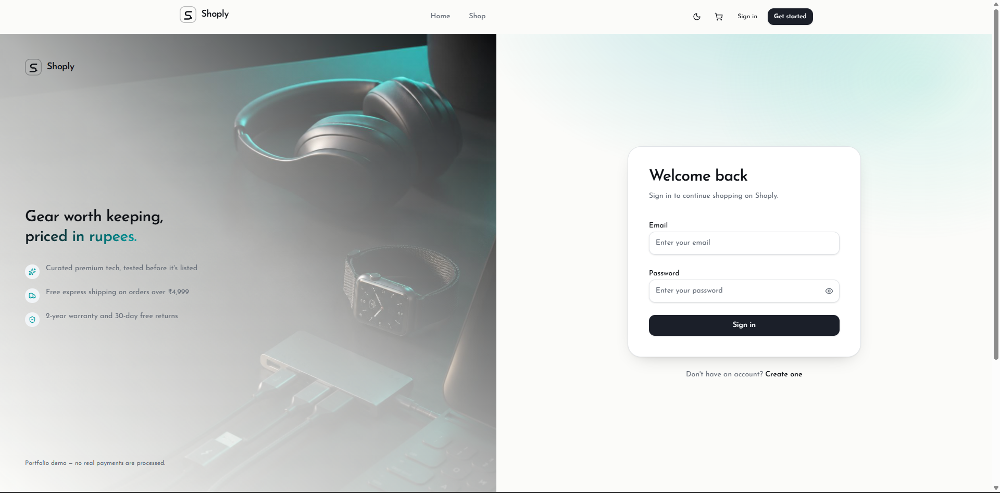
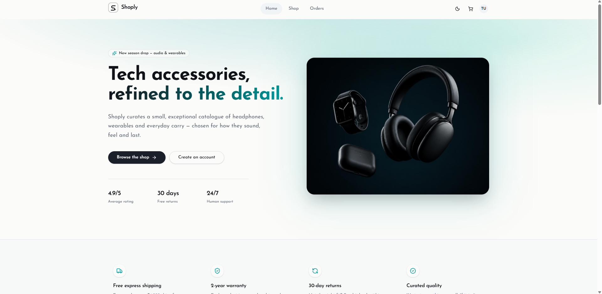
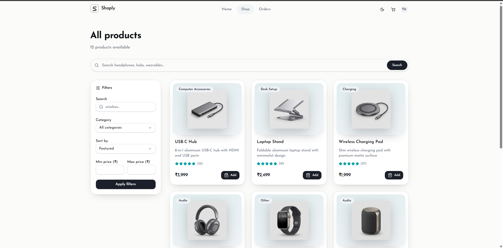
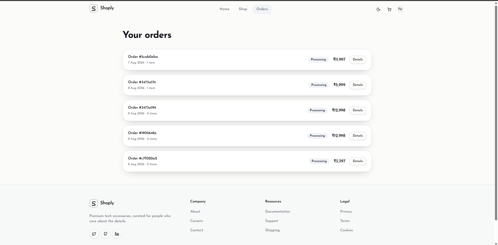

# Shoply

A full-stack **e-commerce web application** built as a portfolio project using the **MERN ecosystem** with a modern React frontend and an Express + MongoDB backend.

Shoply includes user authentication, product browsing with pagination and filters, a shopping cart, checkout flow, order history, reviews, dark/light mode, and a polished responsive UI.

## Live Demo

**Frontend:** https://shoply-five-roan.vercel.app

## Features

- JWT authentication with **HTTP-only cookies**
- Protected routes for authenticated users
- Product listing with **search, category filters, sorting, and pagination**
- Product detail pages with ratings and reviews
- Shopping cart with add, update, and remove functionality
- Checkout flow with shipping address
- Order creation and order history
- Responsive modern UI
- Dark / light mode
- Toast notifications and loading states

## Screenshots

### Login



### Home



### Shop



### Orders



## Tech Stack

### Frontend

- React
- Vite
- TypeScript
- TanStack Router
- TanStack Query
- Tailwind CSS
- shadcn/ui
- Zod

### Backend

- Node.js
- Express.js
- MongoDB
- Mongoose
- JWT Authentication
- HTTP-only Cookies
- Helmet
- CORS
- Express Rate Limit

## Project Structure

```text
shoply/
├── client/
│   ├── src/
│   ├── public/
│   └── package.json
├── server/
│   ├── controllers/
│   ├── middlewares/
│   ├── models/
│   ├── routes/
│   └── package.json
└── README.md
```

## API Endpoints

### Users

| Method | Endpoint              | Description         |
| ------ | --------------------- | ------------------- |
| POST   | `/api/users/register` | Register a new user |
| POST   | `/api/users/login`    | Login               |
| POST   | `/api/users/logout`   | Logout              |
| GET    | `/api/users/me`       | Get current user    |

### Products

| Method | Endpoint            | Description                               |
| ------ | ------------------- | ----------------------------------------- |
| GET    | `/api/products`     | List products with pagination and filters |
| GET    | `/api/products/:id` | Get a single product                      |

### Cart

| Method | Endpoint     | Description                       |
| ------ | ------------ | --------------------------------- |
| GET    | `/api/carts` | Get current cart                  |
| POST   | `/api/carts` | Create cart                       |
| PATCH  | `/api/carts` | Add, update, or remove cart items |

### Orders

| Method | Endpoint          | Description       |
| ------ | ----------------- | ----------------- |
| POST   | `/api/orders`     | Create an order   |
| GET    | `/api/orders`     | Get user orders   |
| GET    | `/api/orders/:id` | Get order details |

### Reviews

| Method | Endpoint                  | Description         |
| ------ | ------------------------- | ------------------- |
| GET    | `/api/reviews/:productId` | Get product reviews |
| POST   | `/api/reviews/:productId` | Create a review     |

## Environment Variables

### Backend (`server/.env`)

```env
PORT=5000
MONGO_URI=your_mongodb_connection_string
JWT_SECRET=your_jwt_secret
CLIENT_URL=http://localhost:5173
```

### Frontend (`client/.env`)

```env
VITE_API_URL=http://localhost:5000
```

## Getting Started

### Clone the repository

```bash
git clone https://github.com/yourusername/shoply.git
cd shoply
```

### Backend

```bash
cd server
npm install
npm run dev
```

### Frontend

```bash
cd client
npm install
npm run dev
```

## Test Account

```text
Email: test@test.com
Password: Test1234
```

## License

This project was built as a **personal portfolio project** and is intended for learning and demonstration purposes.
